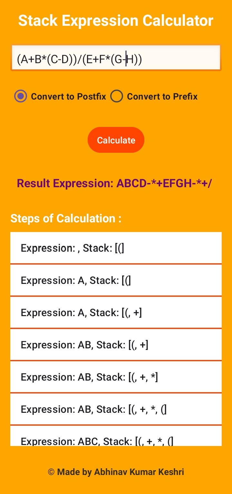
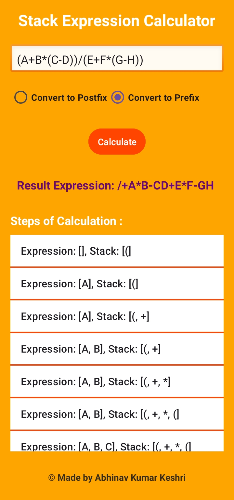

# 📱 Stack Expression Calculator (Android)

## 🚀 Overview

An Android application that evaluates mathematical expressions using **Stack Data Structure**.
It supports **Infix → Postfix/Prefix conversion** and step-by-step evaluation.

---

## ✨ Features

* 🔄 Convert **Infix to Postfix / Prefix**
* 🧠 Stack-based expression evaluation
* 📋 Step-by-step calculation breakdown
* 📱 Clean and simple Android UI
* ⚠️ Basic error handling for invalid expressions

---

## 🛠 Tech Stack

* **Language:** Java
* **Platform:** Android SDK
* **Concepts Used:** Stack, Expression Parsing, Data Structures

---

## 📸 App Preview

<p align="center">
  
  
  
</p>

---

## 🧠 Concepts Implemented

* Stack Operations (Push, Pop, Peek)
* Infix to Postfix Conversion Algorithm
* Prefix Conversion Logic
* Expression Evaluation using Stack

---

## ▶️ How to Run

1. Clone or download this repository
2. Open in **Android Studio**
3. Let Gradle sync
4. Run on emulator or physical device

---

## 📌 Project Structure

```
app/
 └── src/main/
      ├── java/        # Core logic & activities
      ├── res/         # UI layouts (XML)
      └── AndroidManifest.xml
```

---

## 🎯 Future Improvements

* Add scientific calculator features
* Improve UI/UX with Material Design
* Add history of calculations
* Support more complex expressions

---

## 👨‍💻 Author

**Abhinav Kumar Keshri**

---


